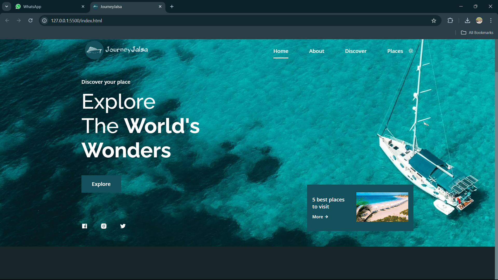
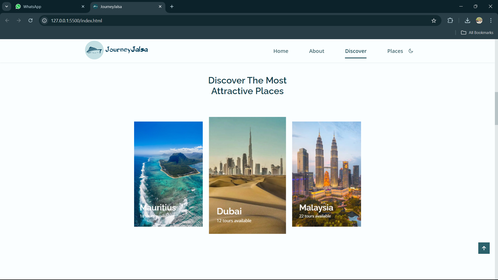
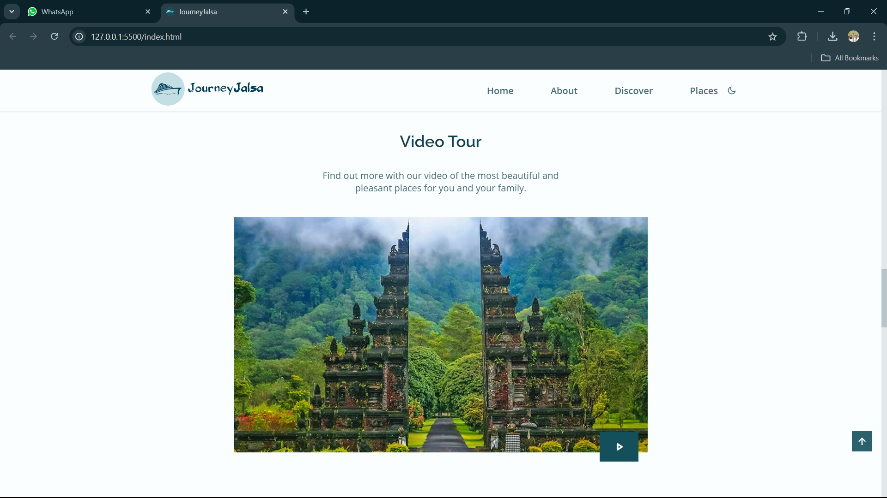

JourneyJalsa

Overview

JourneyJalsa is a responsive travel website template designed for travel enthusiasts and tourists. This template is built using HTML, CSS, and JavaScript, showcasing my skills in web development.

Features

- Responsive design for optimal viewing on desktop and mobile devices
- Attractive and modern UI/UX design
- Interactive elements using JavaScript
- Easy to navigate and user-friendly interface

Template Screenshots

  

  

Technologies Used

- HTML5
- CSS3
- JavaScript

How to Use

1. Download or clone the repository
2. Open the index.html file in a web browser to view the template

Customization

Feel free to customize the template as per your requirements. You can modify the HTML, CSS, and JavaScript files to suit your needs.

License

This template is licensed under the MIT License. You are free to use, modify, and distribute it.

Full Image:
;

  
Author

Aadil Ansari

Contact

ansariaadil786092@gmail.com

https://www.linkedin.com/in/aadil-ansari-qadri/
